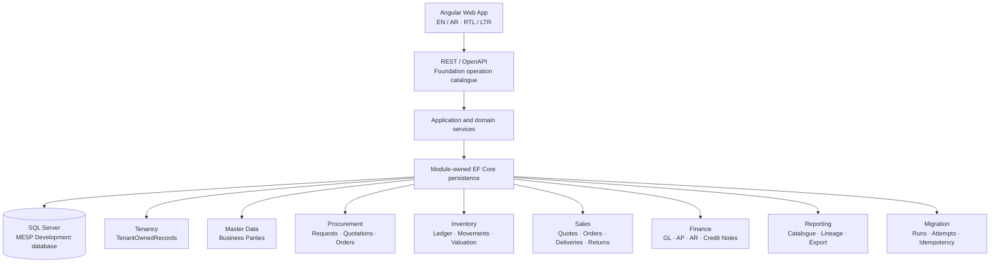

<p align="center">
  <picture>
    <source media="(prefers-color-scheme: dark)" srcset="frontend/assets/Logo_16_9_BG_Removed_Dark.png">
    
  </picture>
</p>

<h1 align="center">Mini_ERP_SaaS_Platform</h1>

<p align="center"><strong>A reusable bilingual, multi-tenant ERP foundation for Saudi small and medium businesses.</strong></p>

<p align="center">
  <a href="https://dotnet.microsoft.com/"></a>
  <a href="https://angular.dev/"></a>
  <a href="https://www.typescriptlang.org/"></a>
  <a href="https://www.microsoft.com/sql-server"></a>
  <a href="https://playwright.dev/"></a>
  
  
</p>

---

MESP is a generic SaaS ERP product under active Release 1 development. Its
architecture is shared across Tenants. These are product rules, not customer-specific forks:

- Tenant isolation;
- organization scope;
- configuration-led business behavior;
- server-authoritative authorization;
- module-owned persistence.

Where things stand:
- The source repository is GitHub `Hossam1104/Mini_ERP_SaaS_Platform`.
- Work is tracked in GitHub Issues and the Project
  [`MESP — Mini ERP SaaS Platform`](https://github.com/users/Hossam1104/projects/1). Items are
  referenced as `MESP-<n> (#<issue>)`.
- Jira is read-only historical provenance.

## Status

The live position is in [`docs/ROADMAP.md`](docs/ROADMAP.md): done, in progress, next, blocked and
deferred, with every line linked to its tracker item. The latest work is logged in
[`RESULT.md`](RESULT.md), newest entry first. Live Git and the tracker outrank both files.

- **Capability completion is 24/26 (92.3%).** That is not production readiness, which is about 47%
  overall and 41% for Procurement/P2P.
- **The active capability is MESP-141 (#229)**, Data Migration and Tenant Onboarding.
- **MESP-48 (#137) and MESP-50 (#139)** remain open production gates.

## Product direction

MESP is designed as a Saudi-localized B2B ERP baseline with English and Arabic
workflows, RTL support, multi-currency reference data, configurable Tax
references, auditability, and a country-pack-friendly architecture. It is not a
Retail POS product and is not a customer fork. A validation Tenant may use
local fixture naming during Development, but no product rule branches on a
customer name.

Release 1 covers the connected business domains needed for a reusable ERP:

- Procurement and Purchase-to-Pay;
- Inventory and Warehouse Management;
- B2B Sales and Order-to-Cash;
- Accounts Receivable, Accounts Payable, Core Accounting and Cash;
- Reporting and Analytics;
- Administration, Tenancy, security, audit, migration and onboarding.

[`docs/ROADMAP.md`](docs/ROADMAP.md) separates the domains Release 1 requires from what is actually
usable today.

## Architecture



The backend is a modular monolith with the enforced project direction
`MiniErp.Api → MiniErp.Infrastructure → MiniErp.App → MiniErp.Contracts`.
Contracts hold stable public shapes, App owns application and domain seams,
Infrastructure owns provider-specific persistence and migrations, and Api is
the host and composition root. Application modules are `Audit`,
`BusinessParties`, `Finance`, `Identity`, `Inventory`, `MasterData`,
`Migration`, `Notifications`, `Platform`, `Procurement`, `Reporting` and
`Sales`.

SQL Server is the configured local Development provider when explicitly
enabled; SQLite remains an explicit test and fallback provider where supported.
Production startup does not auto-migrate.

### Boundaries that hold across modules

- **Tenant is the hard security boundary.** Company, Branch and Warehouse are
  operational scopes *inside* an already authorized Tenant. A hostname supplies
  candidate routing only, never authorization.
- **Module ownership is exclusive.** Sales owns the commercial chain, Inventory
  owns physical stock truth, Finance owns GL, AP, AR, credit notes and tax
  effects. Operational modules never fabricate accounting entries outside the
  approved Finance contract.
- **Cross-module work is durable, not distributed-ACID.** The pattern is
  durable source evidence, downstream owner-local commit, deterministic effect
  identity, idempotent retry, explicit acknowledgement and reconciliation
  state, and fail-closed mismatch protection.
- **Posted facts are immutable.** Corrections happen through reversal or
  successor documents with retained lineage, never destructive rewrite.

## Technology stack

| Layer | Repository technology |
|---|---|
| Web client | Angular 22.1, TypeScript 6.0.2, standalone components, RxJS 7.8 |
| API / application | .NET 10 (SDK 10.0.400), C# 14, ASP.NET Core, REST/OpenAPI |
| Persistence | EF Core 10.0.10, SQL Server provider, SQLite test/fallback provider |
| API reference | Generated OpenAPI, rendered with Scalar in Development/QA only |
| Unit / architecture tests | Vitest 4.x on the frontend; xUnit 2.9.2 with .NET test SDK 17.12 |
| Browser checks | Playwright 1.62.1 |
| Local runtime | PowerShell launcher, SQL Server `MESP`, Angular proxy |

Every public REST operation is expected to carry Foundation catalogue metadata,
generated OpenAPI documentation, and an architecture/contract test. Scalar is a
Development/QA rendering of that generated contract, not a production surface.

## Repository map

```text
backend/        .NET projects, module application code, persistence and tests
frontend/       Angular shell, feature workspaces, unit tests and Playwright
scripts/        Official local Development and validation helpers
docs/           PROJECT, ARCHITECTURE, ROADMAP, DECISIONS, MODEL_ROUTING
docs/requirements/  Approved BRDs and the business glossary
docs/assets/    PRD, presentation and wireframes (non-Markdown)
docs/audit/     Cleanup audit: drift report, plan, tracker reconciliation
docs/history/   Archived records (not authority)
AGENTS.md       Working agreement and executor rules (CLAUDE.md points here)
TASK.md         The single next executor prompt and the Planner's next-task summary
RESULT.md       Shared results log, newest first
RUN.md          Local runtime, SQL and validation guide
```


## Local quick start

Prerequisites:

- .NET SDK 10.0.400 (pinned in `backend/global.json`);
- Node.js/npm compatible with the checked-in `package-lock.json`;
- Angular CLI dependencies installed by `npm install`;
- SQL Server for the local `MESP` Development database when exercising the
  authoritative SQL path.

The official launcher is the normal path. Configure local values in the process
or user environment; never commit them:

```powershell
$env:ASPNETCORE_ENVIRONMENT = 'Development'
$env:MESP_SQLSERVER_CONNECTION_STRING = '<your local SQL Server connection configured outside Git>'
$env:MESP_DEV_AUTH_BYPASS = 'true' # explicit local convenience; disabled by default
$env:MESP_DEV_TENANT_DISPLAY_NAME = 'Local validation workspace'

dotnet build .\backend\MiniErp.sln --configuration Release
.\scripts\Start-MiniErpDevelopment.ps1 -ApiPort 5300 -FrontendPort 4300 -Restart
```

The local SQL target convention is server `.` and database `MESP`; the
connection value itself must stay outside tracked documentation. The
Development bypass is exact-environment, loopback-only, server-actor based, and
does not bypass ordinary authorization or allow client impersonation. It fails
startup if enabled outside Development. For normal credential testing, leave it
disabled and follow [`RUN.md`](RUN.md).

> **Note for test runs:** because the bypass guard fails closed, leaving
> `MESP_DEV_AUTH_BYPASS=true` in your ambient shell will fail the host security
> suite with `permitted only when ASPNETCORE_ENVIRONMENT is exactly
> Development`. Clear it — or use `.\scripts\Test-MiniErpBackend.ps1` — before
> running tests.

Expected local addresses:

- Angular / common entry: <http://localhost:4300>
- Tenant entry fixture: <http://tenant.localhost:4300>
- Platform boundary fixture: <http://admin.localhost:4300>
- API health: <http://localhost:5300/health>
- OpenAPI / Scalar: Development/QA-only surfaces described in [`RUN.md`](RUN.md)

The launcher and generated proxy preserve the browser `Host` so the API can
resolve the entry mode. The browser consumes `auth/entry`; it does not
authorize a Tenant from a subdomain, route parameter, local storage, or any
client-supplied Tenant identifier.

If another local service owns port 5000, the explicit 5300/4300 override keeps
that unrelated service untouched.

## Database and migrations

The Development SQL database is `MESP`, with module-owned schemas and separate
EF migration histories per module context. Tenancy owns the shared
`tenancy.TenantOwnedRecords` table; other module contexts do not compete for
that physical table. Formal migrations are intentionally a Development and
runtime concern here. Deployment migrations, backup and restore, high
availability, capacity, retention and residency, and production cutover all
remain open gates.

## Quality checks

Run from the repository root:

```powershell
# Safe backend test runner — uses a dedicated disposable LocalDB connection.
# This script assigns a MiniErpFoundation_* target only to
# MESP_SQLSERVER_SAFETY_CONNECTION_STRING and leaves the persistent
# MESP_SQLSERVER_CONNECTION_STRING runtime variable completely unchanged.
.\scripts\Test-MiniErpBackend.ps1

# Or run the full Foundation validation (backend + Angular + Playwright + audit):
.\scripts\validate-foundation.ps1
```

Frontend checks from `frontend/`:

```powershell
npm test -- --watch=false
npm run build
npm run test:e2e
npm audit --omit=dev
```

Environment variable roles:

| Variable | Purpose |
|---|---|
| `MESP_SQLSERVER_CONNECTION_STRING` | Persistent Owner Development database (SQL Server `.` / `MESP`). Used by the application runtime only. |
| `MESP_SQLSERVER_SAFETY_CONNECTION_STRING` | Disposable `MiniErpFoundation_*` LocalDB target for destructive SQL safety tests. Never points at `MESP`. |

Do not conflate them. The safety harness rejects any connection that is not
`(localdb)\MSSQLLocalDB` with a `MiniErpFoundation_*` database name, and the
SQL Server safety suite reports as **gated** rather than passing when
`MESP_SQLSERVER_SAFETY_CONNECTION_STRING` is absent. Gated evidence is never
reported as passed.

CI is the repository-owned GitHub Actions workflow `.github/workflows/ci.yml`. The `main` ruleset
requires three checks: `Repository Validation`, `Backend` and `Frontend`. Hosted CI excludes the LocalDB SQL Server
safety suite, which runs locally through `.\scripts\Test-MiniErpBackend.ps1`.
Continuous deployment is not implemented. A passing local Development suite or
hosted CI run does not by itself establish production readiness.

## Documentation

- [Project: goal, scope, module rules, requirements index, glossary](docs/PROJECT.md)
- [Architecture: layers, modules, enforcement, stack, environments](docs/ARCHITECTURE.md)
- [Roadmap: live plan linked to the tracker](docs/ROADMAP.md)
- [Decisions: owner/planner decisions and the ADRs](docs/DECISIONS.md)
- [Model routing and operating model](docs/MODEL_ROUTING.md)
- [Working agreement and executor rules](AGENTS.md)
- [Local Development and integrated runtime guide](RUN.md)
- [Backend technical reference](backend/README.md)
- [Frontend technical reference](frontend/README.md)
- [Business requirements (BRDs)](docs/requirements/)

## Production-readiness disclaimer

MESP is **not** production-ready and is not advertised as such. Open areas
include deployment topology, secure production identity and infrastructure, SQL
provider and production migration governance, backup and restore, capacity and
performance, monitoring, legal and privacy review, Saudi statutory and
regulatory validation, specialist accounting and inventory review, migration
and cutover, and external integration decisions.

No ZATCA, FATOORA, statutory, tax-authority, or certification readiness is
claimed anywhere in this repository. Do not use the Development authentication
convenience or the local database process as a production deployment model.

## Scope discipline

- **One capability at a time.** Only positive authority activates it. MESP-142 (#230) is not
  activated. Later MESP-141 slices are not activated.
- **Open migration decisions stay open.** M40-DEC-001 through M40-DEC-006 remain open, and no
  implementation may decide them implicitly.
- **Owner-managed assets are off-limits.** Source assets under `frontend/assets` must never be
  deleted, renamed, replaced, regenerated, optimized, recolored, moved or restored from Git without
  explicit owner instruction.
- **Out of Release 1 scope:** Retail POS, customer-specific core forks, external production
  integrations and statutory implementation.
